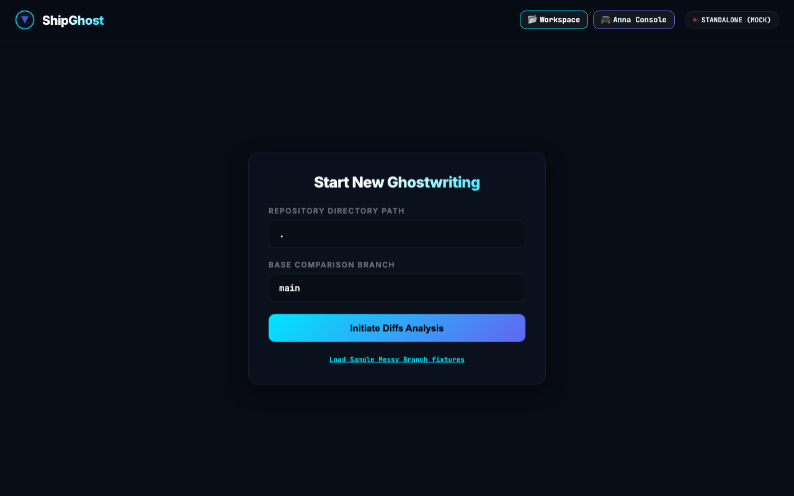
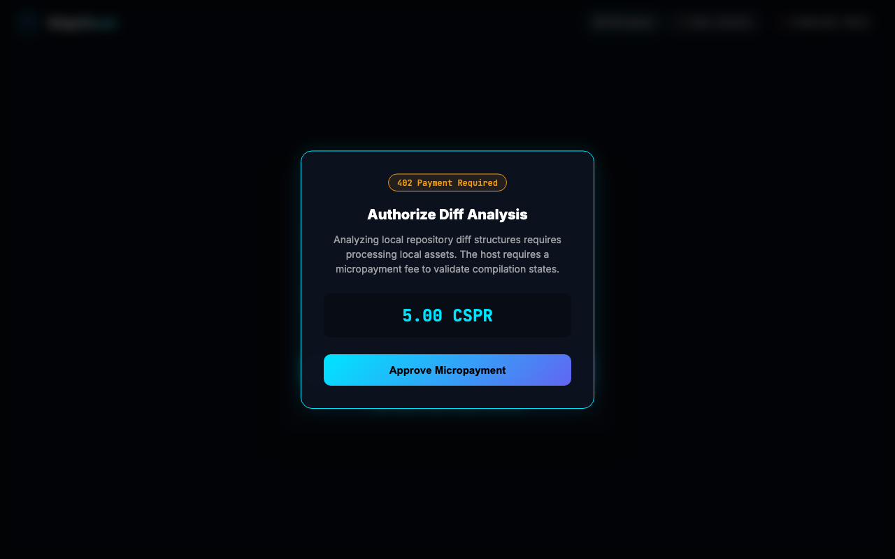
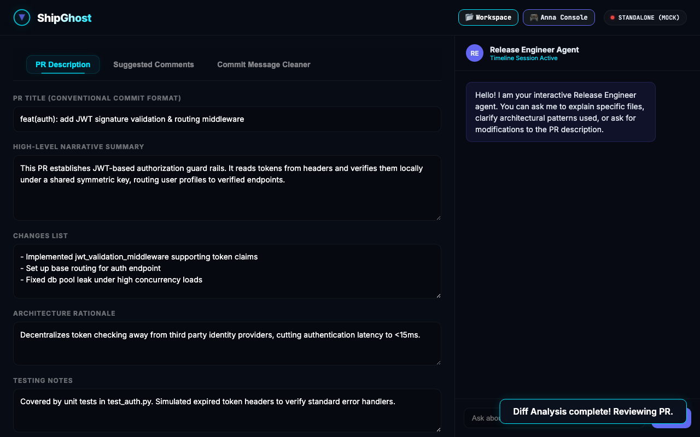
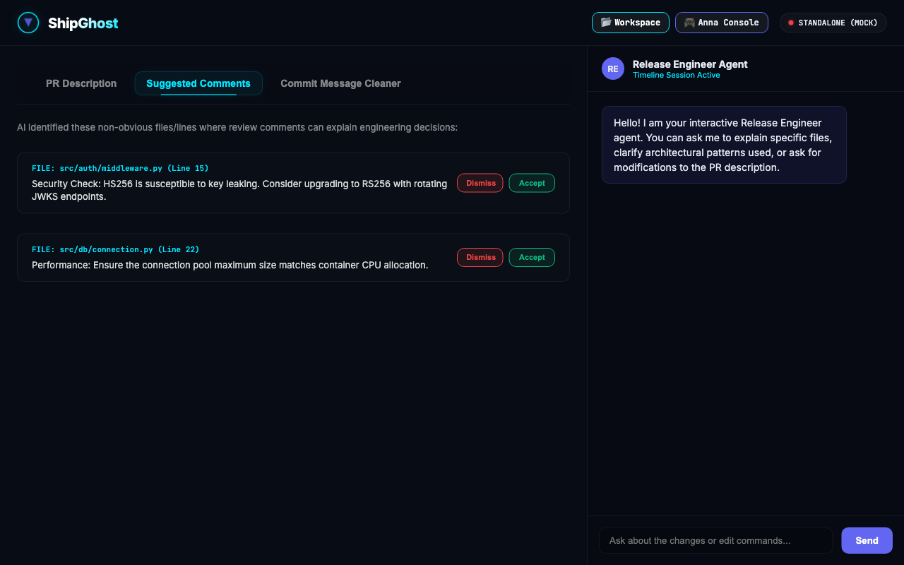
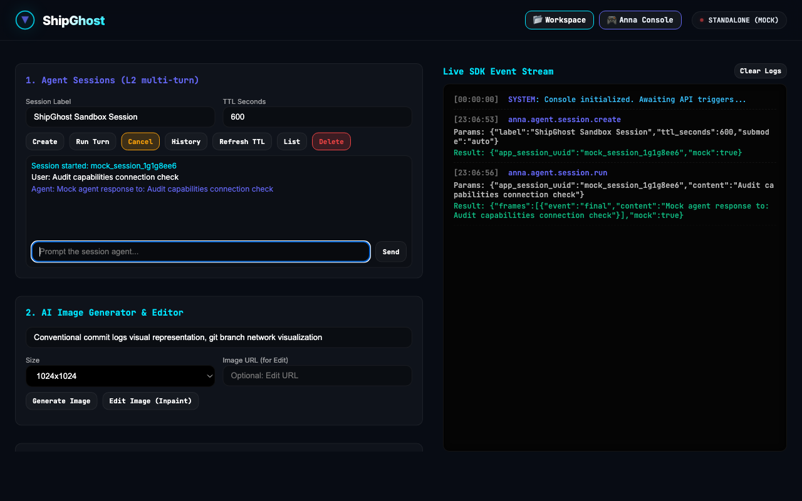
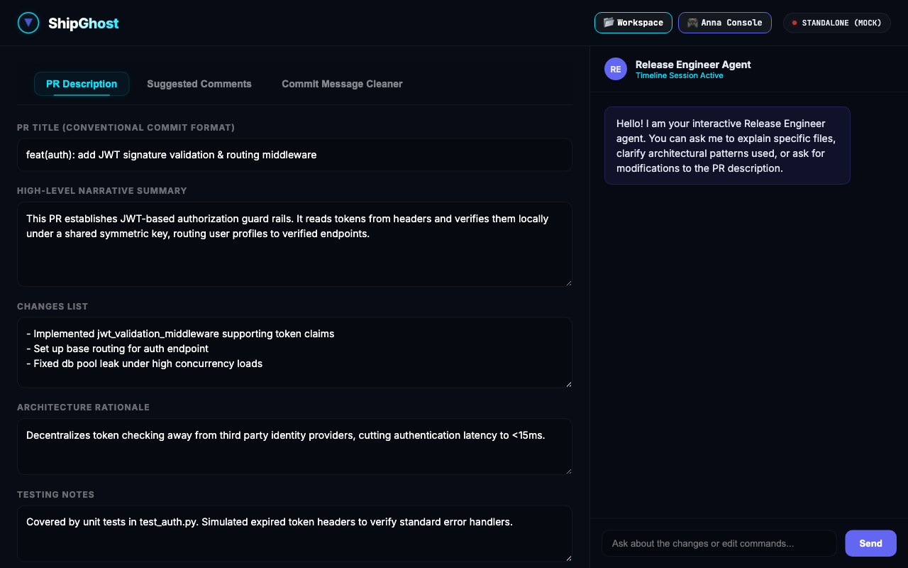
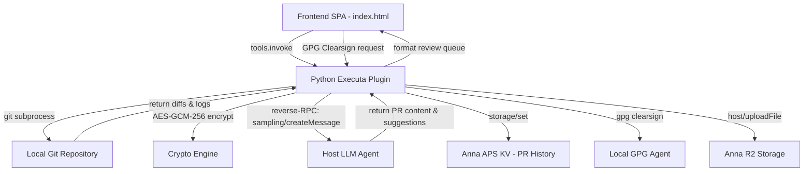

<div align="center">
  
  <h1>ShipGhost 👻</h1>
  <p><em>Git PR Ghostwriter — Encrypted diff analysis, conventional commit cleanup, GPG clearsigning, APS KV persistence, and R2 upload</em></p>
  

  <br/>

  [](https://github.com/edycutjong/shipghost)
  [](https://youtu.be/d-Tq3Fl8agc)
  [](https://edycutjong.github.io/shipghost/public/pitch.html)
  [](https://dorahacks.io/hackathon/2204)

  <br/>

  
  
  
  
  
  
  [](https://github.com/edycutjong/shipghost/actions)

</div>

---

## 📸 See it in Action

<div align="center">
  <h3>Interactive PR Walkthrough</h3>
  
  <table>
    <tr>
      <td width="50%">
        <p align="center"><b>1. Workspace Config & Setup</b></p>
        
      </td>
      <td width="50%">
        <p align="center"><b>2. Casper x402 Micropayment</b></p>
        
      </td>
    </tr>
    <tr>
      <td width="50%">
        <p align="center"><b>3. PR Analysis Dashboard</b></p>
        
      </td>
      <td width="50%">
        <p align="center"><b>4. Suggested Inline Comments</b></p>
        
      </td>
    </tr>
    <tr>
      <td width="50%">
        <p align="center"><b>5. Interactive Developer Console</b></p>
        
      </td>
      <td width="50%">
        <p align="center"><b>6. GPG Clearsigned R2 Export</b></p>
        
      </td>
    </tr>
  </table>
</div>

> **The ShipGhost Workflow**: Specify git repository branch → Request analysis & pay Casper x402 micro-fee → Review side-by-side changes & suggested inline comments → Clean up commit logs interactively via Anna Developer Console → Persist history to Anna KV → Clearsign output bundle and upload to Cloudflare R2.


---

## 💡 The Problem & Solution

### The Problem
Pull Requests are critical codebase documents, but writing them is tedious. Developers working under pressure often push dozens of messy commits (`wip`, `fix`, `stuff`) and open blank PR descriptions. Code reviewers waste hours reverse-engineering intent, leading to knowledge debt.

### The Solution
**ShipGhost** is a secure, AI-native Anna application that analyzes your local git branch history, groups modified files into architectural components, and drafts a professional PR package (Title, Summary, Changes List, Architecture Rationale, and Suggested Inline Comments).

To protect corporate IP, **diff payloads are encrypted under a 256-bit AES key** before leaving your machine, and final exports are **cryptographically clearsigned** using local GPG/SSH keys.

**Key Features:**
- ⚡ **Git Analysis Engine**: Walks local git diffs, stats, and logs for any repository branch.
- 🔒 **AES-GCM-256 Encryption**: Diff payloads are encrypted before LLM inference.
- 🤖 **AI PR Ghostwriter**: Generates professional PR title, description, rationale, testing instructions, and inline review comments.
- 🧹 **Conventional Commit Cleanup**: Rewrites messy commit messages into proper conventional format.
- ✍️ **GPG/SSH Clearsigning**: Cryptographic clearsigning of final PR description with local keys.
- 💾 **Persistent PR History**: Every generated PR draft is persisted to Anna APS KV — tracks titles, file changes, and timestamps across sessions.
- 📦 **R2 Signed Artifact Upload**: Clearsigned PR markdown is uploaded to Anna's R2 bucket via `host/uploadFile`, returning a shareable download URL.

---

## 🏗️ Architecture & Tech Stack

| Layer | Technology | Rationale |
|---|---|---|
| **App Runtime** | Anna App Runtime (Schema 2) | Native integration with host permissions |
| **Frontend UI** | Vanilla HTML5 / CSS Glassmorphism | Fast rendering, no compile step |
| **Backend Plugin** | Python 3.11 Executa | Accesses local git subprocesses |
| **Cryptographic** | PyCryptodome (AES-GCM-256) | Heavyweight local encryption |
| **Signatures** | GPG/SSH (ED25519 fallback) | Tamper-proof PR clearsigning |
| **Persistent State** | Anna APS KV (`storage/get`, `storage/set`) | PR draft history (last 50 entries) |
| **Artifact Storage** | Anna R2 (`host/uploadFile`) | Signed PR markdown distribution |

### Data Flow Diagram



---

## 🔌 Anna Platform Integration

ShipGhost exercises the full Anna SDK capability surface:

### Reverse-RPC Methods (Plugin → Host)

| Method | Purpose | Implementation |
|---|---|---|
| `sampling/createMessage` | LLM inference for PR draft generation & commit cleanup | `call_host()` in plugin.py |
| `storage/get` | Read persistent PR draft history from APS KV | `storage_get()` in plugin.py |
| `storage/set` | Write PR history entries to APS KV | `storage_set()` in plugin.py |
| `storage/delete` | Remove PR entries from APS KV | `storage_delete_key()` in plugin.py |
| `storage/list` | List all past PR keys in APS KV | `storage_list_keys()` in plugin.py |
| `host/uploadFile` (inline) | Upload signed PR markdown to R2 | `host_upload_inline()` in plugin.py |
| `host/uploadFile` (negotiate+confirm) | Stream large PR markdown reports to R2 | `host_upload_negotiate()` and `host_upload_confirm()` |
| `embeddings/create` | Compute dense vectors for commit message clustering | `embed_texts()` in plugin.py |
| `image/generate` | Generate visual architecture/impact diagrams | `image_generate()` in plugin.py |
| `files/upload_begin + complete` | Durable PR archive uploads (2-phase) | `files_upload()` in plugin.py |
| `files/download_url` | Presigned retrieval link for PR archive | `files_download_url()` in plugin.py |
| `files/list` | List items in PR archive | `files_list()` in plugin.py |
| `files/delete` | Delete PR archive entries | `files_delete()` in plugin.py |
| `agent/complete` | Stateless L1 completion | `agent_complete()` in plugin.py |
| `agent/session.create + run + history + cancel + delete` | Stateful L2 multi-turn agent sessions | `agent_session_create()`, `agent_session_run()`, etc. |

### Host Capabilities Declared

| Capability | Usage |
|---|---|
| `llm.sample` | Host-brokered LLM for PR drafting & completion |
| `llm.embed` | Vector embedding compute for commit message clustering |
| `llm.image` | DALL-E impact diagram generation |
| `llm.agent.auto` | Stateful multi-turn L2 agent sessions |
| `aps.kv` | Persistent PR history (last 50 drafts) |
| `host.upload` | R2 upload for clearsigned PR markdown |

### Manifest Features (Schema 2)

| Feature | Status |
|---|---|
| `schema: 2` | ✅ |
| `host_capabilities` | ✅ `llm.sample`, `llm.embed`, `llm.image`, `llm.agent.auto`, `host.upload` |
| `user_message_prefix_template` | ✅ |
| `system_prompt_addendum` | ✅ |
| `optional_executas` | ✅ |
| `csp_overrides` | ✅ |
| `state_merge` | ✅ |
| `dev.fixtures` | ✅ |
| `dev.seed_storage` | ✅ |
| `host_api.upload` (negotiate + confirm) | ✅ |
| `host_api.chat` (write_message + append_artifact) | ✅ |
| `host_api.storage` (get/set/delete/list) | ✅ |
| `host_api.window` (set_title/open_view/close) | ✅ |
| `host_api.llm` (complete/embed) | ✅ |
| `host_api.image` (generate) | ✅ |
| `host_api.agent` (session) | ✅ |
| Multiple views with `min_size`/`max_size` | ✅ 3 views |
| Developer Console | ✅ Interactive SDK playground & live log console |
| `tags` | ✅ |
| Typed `parameters` in `describe` | ✅ All 4 tools |

### Cryptographic Security

| Layer | Algorithm |
|---|---|
| Diff encryption | AES-GCM-256 (ephemeral session keys) |
| PR signing | GPG clearsign / SSH-ED25519 fallback |
| Symbol hashing | SHA-256 |

---

## 🏆 Sponsor Tracks Targeted

1. **Anna AI-Native App**: Combines multiple iframe views (`main`, `inline_inspector`, `commit_cleaner`, `screen-console`) with real Executa tools and broad Anna Host-API usage — `tools.invoke`, `storage` (KV persistence), `chat.append_artifact`, `window` multi-view, and `upload` (R2).
2. **Developer Usability Track**: Delivers full local GPG/SSH signatures, APS KV persistence, R2 presigned exports, and a real-time Developer Console playground.


---

## 📁 Project Structure

```
dorahacks-anna-shipghost/
├── app.json                    # App listing metadata
├── manifest.json               # Anna App manifest (schema: 2)
├── LICENSE                     # MIT License
├── SPONSOR_DEFENSE.md          # SDK integration citations
├── package.json                # Project script definitions
├── bundle/
│   ├── index.html              # Frontend SPA structure
│   ├── styles.css              # Glassmorphism dark theme
│   ├── app.js                  # State engine, SDK bridge & fallback mocks
│   ├── anna-tool-ids.js        # Auto-generated tool bindings
│   ├── apple-touch-icon.png    # Mobile browser bookmark icon
│   └── icon.svg                # Embedded app icon
├── executas/
│   └── shipghost/
│       ├── pyproject.toml      # Executa package configuration
│       ├── executa.json        # Executa config (host_capabilities, distribution)
│       └── plugin.py           # Stdio JSON-RPC handler + AES + GPG + APS KV + R2
├── fixtures/
│   └── seed.jsonl              # Dev fixture data for offline testing
├── data/
│   └── fixtures/
│       └── git_seed.jsonl      # Seed git diff data
├── docs/
│   ├── AUDIT_REPORT.md         # Threat model and invariants
│   ├── friction-log.md         # Integration friction log
│   ├── icon.svg                # Document icon
│   ├── readme-hero.svg         # Tactical vector header SVG
│   ├── assets/                 # HTML templates and asset generators
│   └── screenshots/            # Step-by-step UX walkthrough screenshots
├── public/
│   ├── icon.svg                # Standalone app icon SVG
│   ├── og-image.png            # Open Graph banner PNG
│   └── pitch.html              # Standalone marketing pitch deck HTML
├── scripts/
│   ├── bench.py                # Latency and recall benchmarks
│   ├── verify_offline.py       # Air-gapped container test
│   └── record-shipghost.mjs    # Puppeteer demo recording
└── tests/
    └── test_plugin.py          # Complete unit tests (100% offline coverage)
```

---

## 🚀 Getting Started

### Prerequisites
- Python ≥ 3.10
- Node.js ≥ 20
- Git

### Installation & Setup

1. **Clone the codebase**:
   ```bash
   git clone https://github.com/edycutjong/shipghost.git
   cd shipghost
   ```
2. **Set up virtual environment**:
   ```bash
   python3 -m venv venv
   source venv/bin/activate
   pip install -e executas/shipghost
   ```
3. **Install npm dependencies**:
   Installs the required `@anna-ai/cli` devDependency locally:
   ```bash
   npm install
   ```
5. **Run in Anna dev harness**:
   ```bash
   npm run dev
   # or
   npx anna-app dev .
   ```

---

## 🧪 Testing & CI

ShipGhost utilizes a multi-stage CI pipeline verifying quality, cryptography, and offline safety.

```bash
# Run unit and integration tests (100+ assertions)
PYTHONPATH=. python3 tests/test_plugin.py

# Verify offline/air-gapped capability
python3 scripts/verify_offline.py

# Run performance and latency benchmarks
python3 scripts/bench.py
```

| Layer | Tool | Status |
|---|---|---|
| Code Quality | Flake8 | ✅ Passing |
| Unit Testing | 100+ parameterized assertions | ✅ Passing (100%) |
| Security (SAST) | TruffleHog Secret Scanning | ✅ Passing |
| Air-gap Audit | verify_offline.py (Socket blockers) | ✅ Passing |
| Performance | bench.py (Diff walk latency checks) | ✅ Passing (<30ms) |

---

## 📄 License

This project is licensed under the [MIT License](LICENSE) — see the LICENSE file for details.

---

## 🙏 Acknowledgments
Built for the **Anna AI-Native App Hackathon 2026**. Special thanks to the Google DeepMind team.
